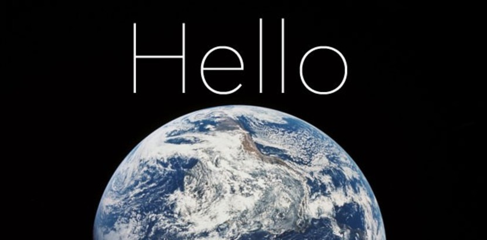

# Reshmi Thumatti Jawaharlal 👩‍💻

 
  Visitor count 
  

## About me

Hi, my name is Reshmi; I m from Tamilnadu, India. I have completed my Bachelor degree in Robotics and Automation Engineering from PSG College of Technology. I'm pursuing a master's degree in applied computer science at Northwest Missouri State University.

My goal is to become a full-stack Java developer. .I am interested in learning new languages and enhance my skills. I love to cook and eat; I play badminton; I exercise; and I love photography.

## Things I am passionate about

- Java 👩‍💻
- Open Source 🥷

## Find me around the web

 

 

  

 

 

<!--
**Reshmitj/Reshmitj** is a ✨ _special_ ✨ repository because its `README.md` (this file) appears on your GitHub profile.

Here are some ideas to get you started:

- 🔭 I’m currently working on ...
- 🌱 I’m currently learning ...
- 👯 I’m looking to collaborate on ...
- 🤔 I’m looking for help with ...
- 💬 Ask me about ...
- 📫 How to reach me: ...
- 😄 Pronouns: ...
- ⚡ Fun fact: ...
-->
